# Chapter 4: Design and Implementation

## 1. System Architecture Design

### 1.1 Architecture Overview

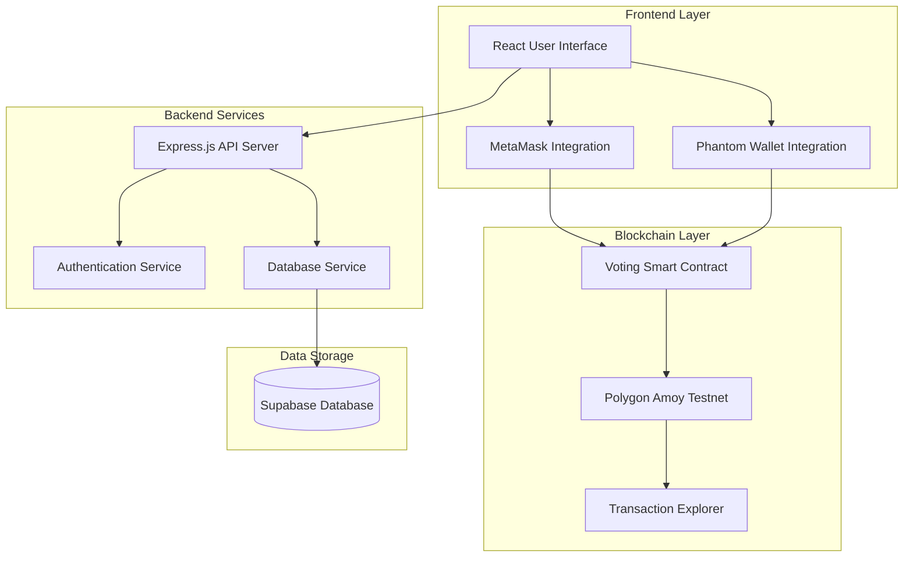

### 1.2 Component Interactions

The BlockVote system architecture consists of four main layers that work together to provide a secure and transparent voting platform:

1. **Frontend Layer**:
   - Built with React, TypeScript, and Tailwind CSS
   - Provides separate interfaces for voters and administrators
   - Integrates with Web3 wallet providers (MetaMask and Phantom)
   - Implements responsive design with Shadcn UI components

2. **Backend Services**:
   - Express.js server handling API requests and authentication
   - Middleware for session management and security
   - Connects to Supabase for data persistence
   - Provides API endpoints for both voter and admin operations

3. **Blockchain Layer**:
   - Smart contracts deployed on Polygon Amoy testnet
   - Implements voting logic, election management, and vote counting
   - Uses Web3.js for blockchain interactions
   - Provides transaction verification and transparency

4. **Data Storage**:
   - Supabase for relational data storage
   - Stores user information, NIN verification status, and admin configurations
   - Blockchain for immutable vote storage and election data

### 1.3 Data Flow

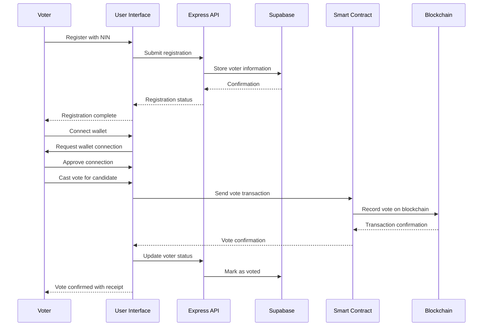

## 2. Implementation of Key Features

### 2.1 Voter Registration

The BlockVote system implements a secure voter registration process that combines traditional identity verification with blockchain technology:

#### Registration Flow

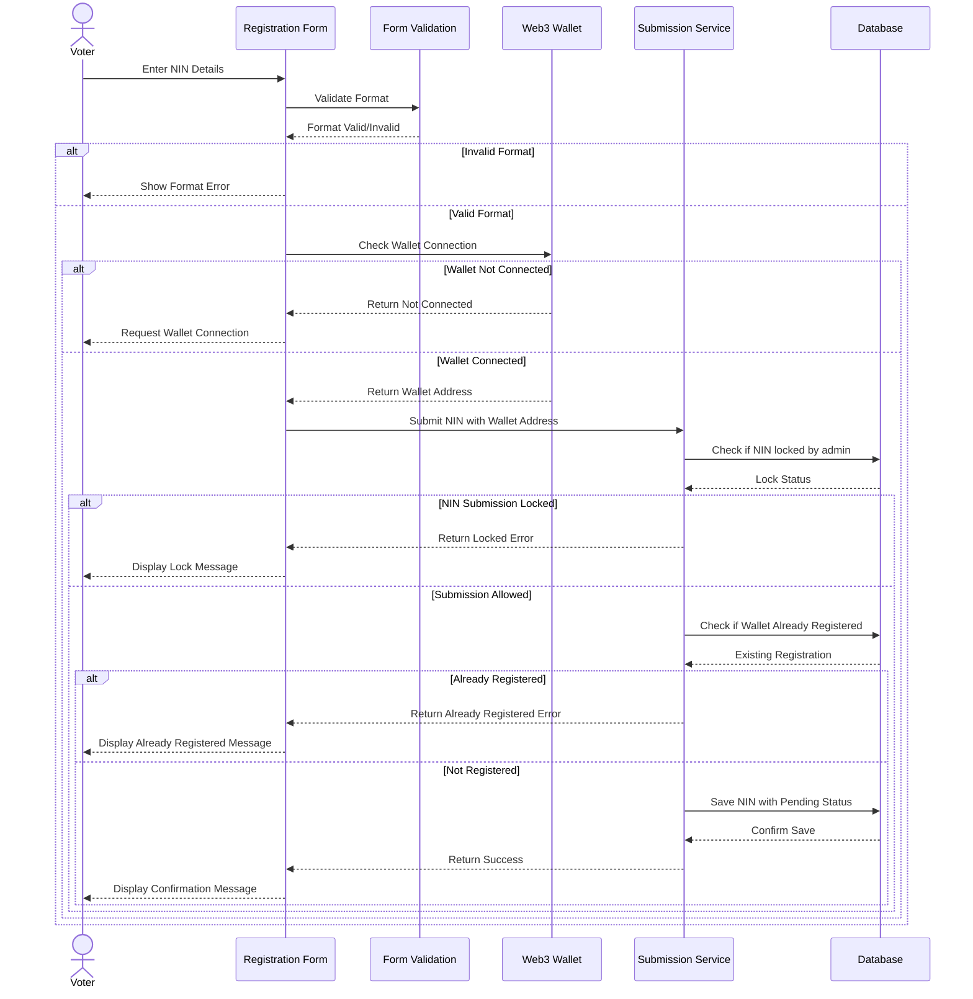

The voter registration flow follows a structured process to ensure security and data integrity:

1. **User Input**: The voter enters their National Identity Number (NIN) into the registration form.

2. **Input Validation**: The system validates the NIN format according to country-specific rules (length, character set, checksum).

3. **Wallet Verification**: The system checks if the user has connected a blockchain wallet (MetaMask or Phantom).

4. **Submission Process**: Once validated, the NIN is submitted along with the wallet address to the backend service.

5. **Duplicate Check**: The system verifies that neither the NIN nor the wallet address is already registered.

6. **Status Assignment**: The NIN is stored with an initial "unverified" status pending admin review.

7. **Confirmation**: The user receives confirmation of successful submission and instructions for next steps.

The entire flow incorporates multiple validation checks and error handling to ensure a smooth user experience while maintaining security requirements.
```

#### Security Measures

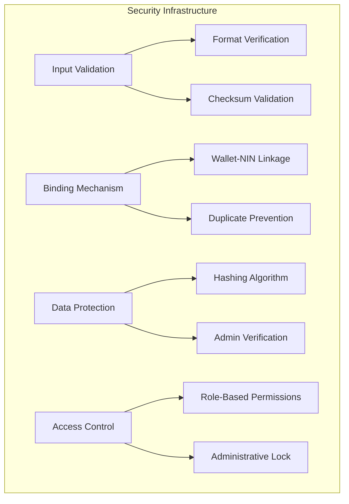

1. **NIN Validation System**:
   - Format validation ensures NIN matches country-specific patterns
   - Length verification confirms the NIN contains the correct number of characters
   - Checksum algorithms validate the internal consistency of the NIN
   - Real-time feedback provides users with immediate information about validation errors

2. **Blockchain Address Binding**:
   - One-to-one relationship between wallet addresses and NIRs
   - Database constraints prevent duplicate registrations
   - Transaction signing verifies wallet ownership before registration
   - Wallet address serves as the primary identifier for all voting transactions

3. **Database Storage Architecture**:
   - Relational database structure with the following schema:
     - `wallet_address`: Primary key, unique identifier linked to blockchain identity
     - `nin`: Encrypted NIN information, secured with industry-standard encryption
     - `status`: Binary verification state ('Y' for verified, 'N' for pending verification)
     - `created_at`: Timestamp recording registration date and time
   - Submissions are initially stored with unverified status pending admin review
   - Data access is restricted through role-based permissions
   - Automatic locking mechanism prevents registration modifications during active elections
```

4. **Admin Verification**: An admin interface allows authorized users to verify submitted NIRs and mark them as eligible to vote.

### 2.2 Ballot Casting

The ballot casting process is the core feature of the BlockVote system, where the actual voting takes place securely on the blockchain:

#### Vote Casting Flow

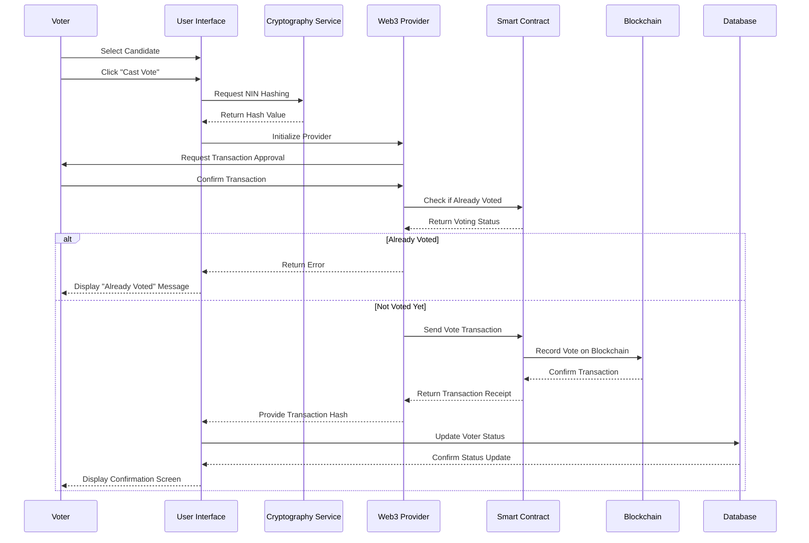

The vote casting process follows these steps:

1. **Candidate Selection**: The voter selects a candidate from the available options in the active election.

2. **Vote Initiation**: Upon clicking the "Cast Vote" button, the system initiates the voting process.

3. **Identity Protection**: The voter's NIN is hashed using SHA-256 to protect their identity while still preventing duplicate voting.

4. **Wallet Connection**: The Web3 provider (MetaMask or Phantom) is initialized and the voter is prompted to approve the transaction.

5. **Duplicate Check**: Before processing the vote, the system checks if the voter has already cast a vote in the current election.

6. **Blockchain Transaction**:
   - If the voter hasn't voted yet, the system creates a blockchain transaction
   - The smart contract receives the vote data (election ID, candidate ID, voter hash)
   - The transaction is signed by the voter's private key and broadcast to the network
   - The blockchain miners validate and add the transaction to a block

7. **Confirmation Processing**:
   - Once the transaction is confirmed, the voter's status is updated in the database
   - The user is presented with a transaction receipt containing the transaction hash
   - This hash serves as proof of voting that can be verified on the blockchain explorer

8. **Error Handling**: Throughout the process, comprehensive error handling ensures voters receive clear messages about any issues.

#### Blockchain Vote Recording Mechanism

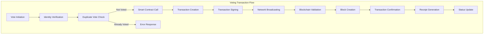

The blockchain recording process involves several technical components:

1. **Smart Contract Interaction**: The application communicates with the deployed VotingSystem smart contract on the Polygon Amoy testnet.

2. **Web3 Provider**: The system uses Web3.js and Ethers.js to interface between the frontend application and the blockchain network.

3. **Transaction Processing**:
   - The transaction includes the election ID, candidate index, and hashed NIN
   - Gas fees are calculated and displayed to the voter before confirmation
   - The transaction is broadcast to the Polygon network for validation

4. **Double-Vote Prevention**: Multiple safeguards prevent duplicate voting:
   - Frontend checks to disable vote button after voting
   - Smart contract verification using the hashed NIN as identifier
   - Database status tracking to prevent multiple vote attempts

5. **Transaction Receipts**: When a vote is recorded, a detailed receipt is generated containing:
   - Transaction hash (unique identifier)
   - Block number where the transaction was recorded
   - Timestamp of the vote
   - Candidate information (without revealing the choice to observers)

#### Anonymity and Privacy Mechanisms

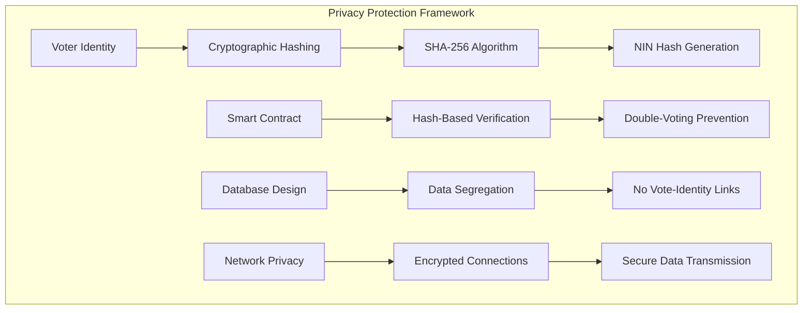

The system implements multiple layers of privacy protection to ensure voter anonymity while maintaining election integrity:

1. **Identity Protection through Cryptographic Hashing**:
   - Personal identifiers (NIRs) are transformed using SHA-256 cryptographic hashing
   - The one-way hashing algorithm prevents reverse-engineering of the original NIN
   - Each hash is prefixed with "0x" to conform with blockchain standards
   - The same NIN always produces the same hash, enabling duplicate vote detection

2. **Blockchain Privacy Architecture**:
   - Only the NIN hash is stored on the blockchain, never the actual identifier
   - The hash serves as a pseudonymous identifier that cannot be traced back to an individual
   - Votes are linked to the hash rather than to personal information
   - The immutable nature of blockchain prevents after-the-fact vote manipulation

3. **Data Segregation Strategy**:
   - Voter identity information is stored separately from voting records
   - The centralized database contains verification status but not voting choices
   - The blockchain contains voting choices but not personal identifiers
   - No single database contains both identity and vote choice information

4. **Technical Implementation of Privacy**:
   - Web3 wallet connections maintain user control over private keys
   - HTTPS encryption for all data transmission between components
   - Database access controls limit viewing of sensitive information
   - Automatic data purging after election completion for non-blockchain components

## 3. Smart Contract Development

### 3.1 Smart Contract Structure

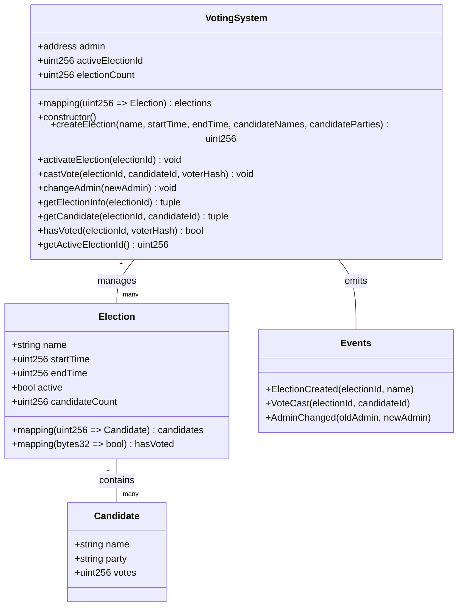

The BlockVote smart contract architecture is centered around a main `VotingSystem` contract that manages all election-related functionality. The contract was developed using Solidity and deployed on the Polygon Amoy testnet.

#### Data Structures

1. **Candidate Structure**:
   - Stores information about each election candidate
   - Properties include:
     - `name`: The candidate's full name
     - `party`: The political party or affiliation of the candidate
     - `votes`: Running tally of votes received by the candidate

2. **Election Structure**:
   - Represents a complete election with all its properties
   - Core attributes:
     - `name`: Title of the election (e.g., "Presidential Election 2025")
     - `startTime` & `endTime`: Unix timestamps defining the voting period
     - `active`: Boolean flag indicating if the election is currently active
     - `candidates`: Mapping of candidate index to Candidate object
     - `candidateCount`: Total number of candidates in the election
     - `hasVoted`: Mapping of voter NIN hash to voting status (prevents double voting)

3. **Storage Architecture**:
   - `admin`: Address of the contract administrator with special privileges
   - `activeElectionId`: ID of the currently active election
   - `electionCount`: Total number of elections created (also used for ID generation)
   - `elections`: Primary data store mapping election IDs to Election structures

#### Core Functionality

The contract implements several key functions:

1. **Administrative Functions**:
   - `createElection`: Creates a new election with specified parameters
   - `activateElection`: Activates a specific election and deactivates any currently active one
   - `changeAdmin`: Transfers administrative control to a new blockchain address

2. **Voting Functions**:
   - `castVote`: Records a vote for a specific candidate in an active election
   - `hasVoted`: Checks if a specific voter (identified by NIN hash) has already voted

3. **Getter Functions**:
   - `getElectionInfo`: Retrieves general information about an election
   - `getCandidate`: Fetches details about a specific candidate
   - `getActiveElectionId`: Returns the ID of the currently active election

4. **Events**:
   - `ElectionCreated`: Triggered when a new election is created
   - `VoteCast`: Emitted when a vote is successfully cast
   - `AdminChanged`: Fired when administrative control is transferred

#### Security Features

The smart contract implements several security measures:

1. **Access Control**:
   - `onlyAdmin` modifier restricts sensitive functions to the designated administrator
   - Function-level validations ensure operations are performed by authorized parties

2. **Input Validation**:
   - All public functions include parameter validation
   - Time-based constraints (e.g., `startTime < endTime`) prevent logical errors

3. **State Protection**:
   - Checks for election existence before operations
   - Prevents duplicate voting through the `hasVoted` mapping
   - Validates candidate indices to prevent out-of-bounds access

4. **Time Constraints**:
   - Enforces election periods using blockchain timestamps
   - Prevents voting before start time or after end time
```

### 3.2 Smart Contract Development Process

1. **Requirements Analysis**: Identified core voting functionality requirements including election creation, vote casting, and result tallying.

2. **Development Environment**:
   - Solidity as the programming language
   - Hardhat for testing and compilation
   - Ethers.js for contract interactions
   - Polygon Amoy testnet as the deployment network

3. **Contract Security Measures**:
   - Admin-only functions for sensitive operations
   - Validation for all input parameters
   - Prevention of double voting
   - Timestamp validation for election periods

4. **Testing and Deployment**:
   - Local testing with Hardhat
   - Testnet deployment with verification
   - ABI generation for frontend integration

## 4. User Interface Design

### 4.1 User Interface Wireframes

#### Voter Registration Page
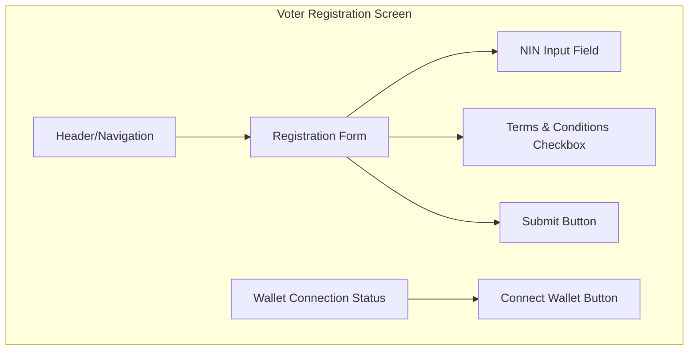

#### Voting Page
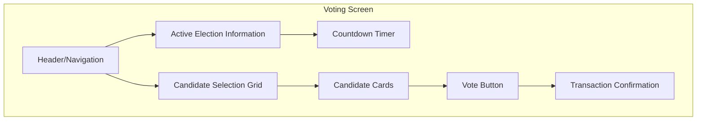

#### Admin Dashboard
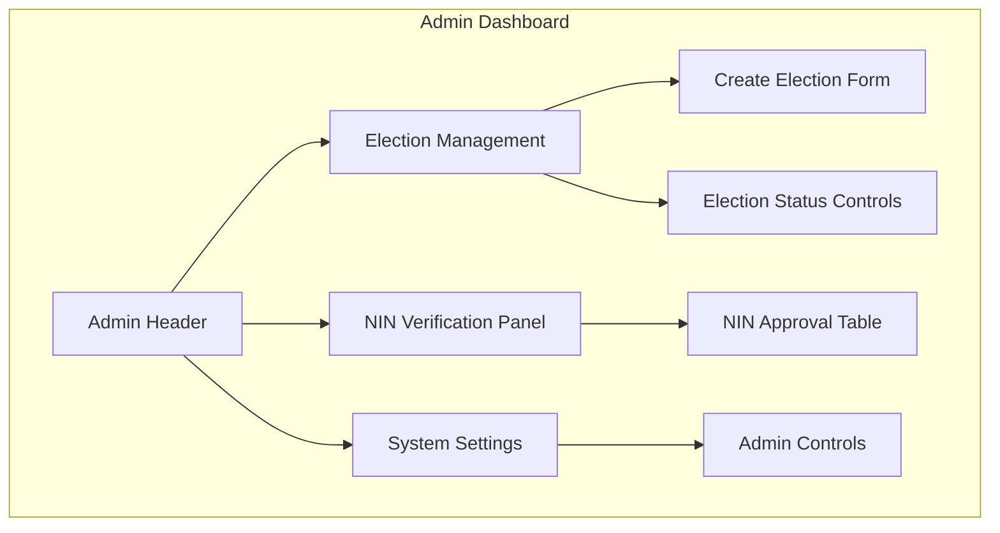

### 4.2 User Interface Implementation

The user interface was implemented using React with TypeScript, Tailwind CSS for styling, and Shadcn UI components for consistent design.

#### Voting Interface Architecture

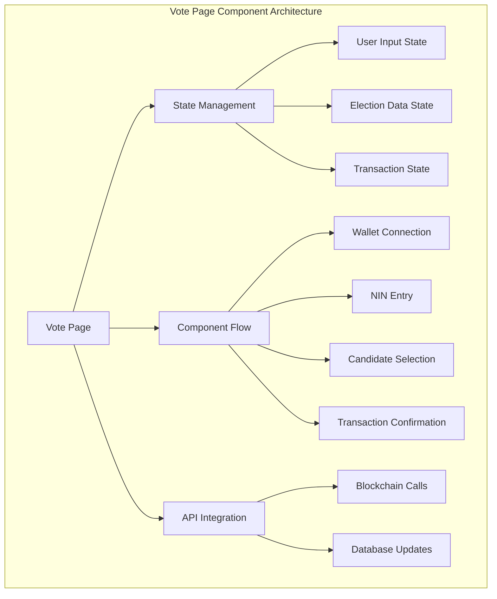

The voting interface follows a multi-stage wizard pattern to guide users through the voting process:

1. **Component Architecture**:
   - Modular design with separate components for each step of the voting process
   - Container-presenter pattern separating data management from presentation
   - Conditional rendering based on the current step in the voting flow

2. **State Management**:
   - React's useState hooks maintain component-level state
   - Multi-step form progression with validated transitions
   - Error states for handling network or validation issues
   - Loading states for asynchronous operations

3. **User Flow Stages**:
   - **Wallet Connection**: Verifies user has connected a Web3 wallet
   - **NIN Verification**: Collects and validates the user's National Identity Number
   - **Candidate Selection**: Presents a grid of candidates for selection
   - **Voting Confirmation**: Initiates blockchain transaction and displays progress
   - **Receipt Display**: Shows transaction details and confirmation after successful voting

4. **Design Patterns**:
   - Responsive layout adapting to different screen sizes
   - Accessible form controls with keyboard navigation
   - Visual feedback for user actions
   - Clear error messaging with recovery options

#### Admin Interface Architecture

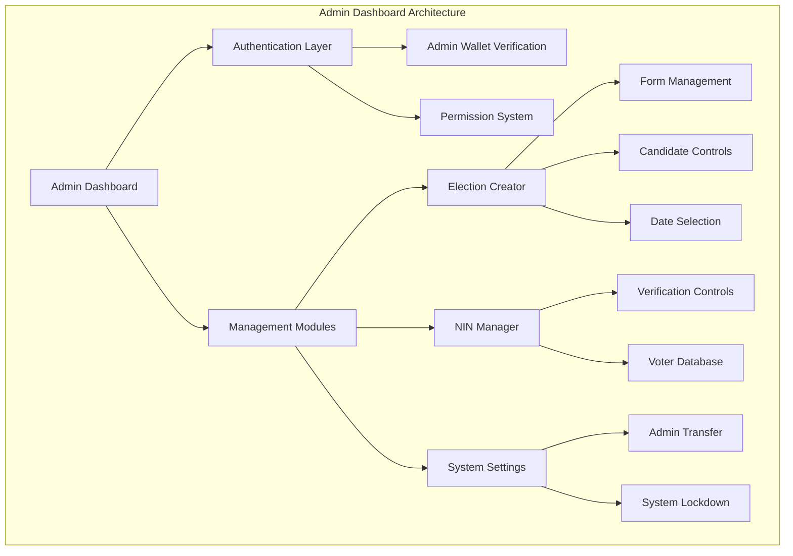

The admin interface provides administrative tools for managing elections and voter verification:

1. **Access Control**:
   - Admin wallet verification using blockchain signatures
   - Role-based permissions restricting sensitive operations
   - Secure session management with automatic timeouts

2. **Election Management Module**:
   - Dynamic form for creating new elections with validation
   - Date-time selection for election periods with automatic validation
   - Candidate management with add/remove functionality
   - Real-time feedback on election creation status

3. **Voter Verification Module**:
   - Tabular display of registered voters with filtering
   - Verification controls for approving legitimate registrations
   - Batch operations for efficient management of multiple records
   - Audit logging of administrative actions

4. **System Configuration**:
   - Lockdown controls to freeze registrations during active elections
   - Admin wallet transfer functionality for organizational changes
   - System status monitoring and alerts
   - Configuration persistence in blockchain and database
```

### 4.3 Usability Considerations

1. **Voter Interface**:
   - Simple, step-by-step process to guide users
   - Clear visual indication of selected candidate
   - Transaction confirmation with receipt
   - Responsive design for mobile and desktop

2. **Admin Interface**:
   - Dashboard with overview statistics
   - Intuitive election creation form
   - Tables for data management
   - Confirmation dialogs for critical actions

## 5. Testing Phase

### 5.1 Testing Approach

The BlockVote system was tested using a comprehensive approach that covered all aspects of the application:

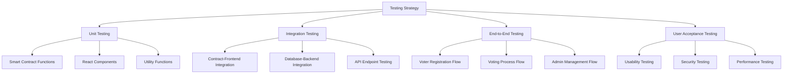

### 5.2 Unit Testing

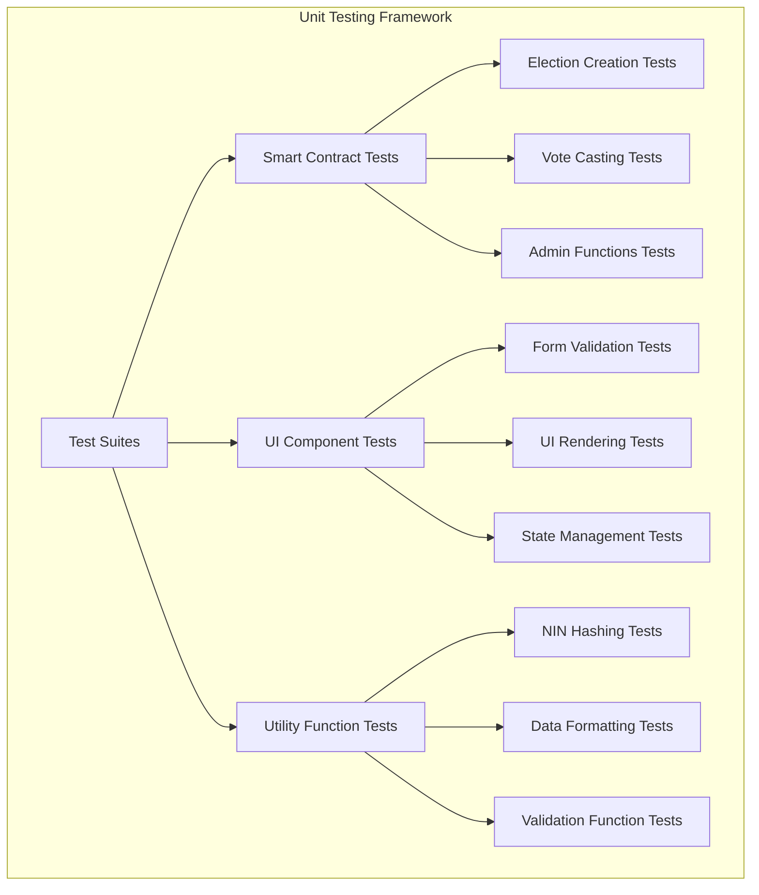

The unit testing strategy focused on isolated testing of individual components:

1. **Smart Contract Testing**:
   - Function-level tests verified each contract function in isolation
   - Test cases covered both happy paths and expected error conditions
   - Assertions validated return values, state changes, and event emissions
   - Special attention to access control and security constraints

2. **Hash Function Validation**:
   - Consistency tests ensured the same input always produces the same hash
   - Uniqueness tests verified different inputs produce different hashes
   - Format tests confirmed hash output matched expected format (0x-prefixed)
   - Edge case tests validated behavior with unusual inputs (empty strings, special characters)

3. **UI Component Tests**:
   - Snapshot tests verified rendering consistency
   - Interaction tests confirmed button clicks and form submissions
   - State tests validated component behavior with different prop combinations
   - Accessibility tests ensured compliance with web standards

4. **Form Validation Tests**:
   - Schema validation ensured data integrity
   - Error message tests verified appropriate user feedback
   - Boundary tests checked input limits and constraints
   - Submission logic tests confirmed proper handling of valid and invalid inputs

### 5.3 Integration Testing

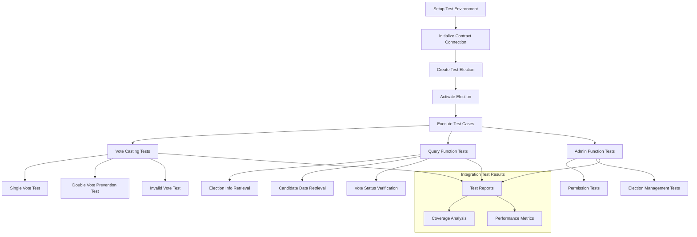

Integration testing validated the interaction between system components:

1. **Test Environment Setup**:
   - Isolated test environment with dedicated contract deployment
   - Controlled state initialization for predictable test conditions
   - Automated setup and teardown between test runs

2. **Blockchain Integration Tests**:
   - Contract interaction verification through complete transaction lifecycles
   - Election creation and management through the contract interface
   - Vote casting with transaction confirmation and event verification
   - Double voting prevention through hash-based identity tracking

3. **Database Integration Tests**:
   - User registration with NIN storage and wallet binding
   - Status updates reflecting voting participation
   - Admin configuration persistence across sessions
   - Synchronization between blockchain and database states

4. **Frontend-Backend Integration**:
   - API endpoint testing with mock and real requests
   - Data flow verification from user input to storage
   - Error handling and recovery across system boundaries
   - Transaction lifecycle management from initiation to confirmation

### 5.4 End-to-End Testing

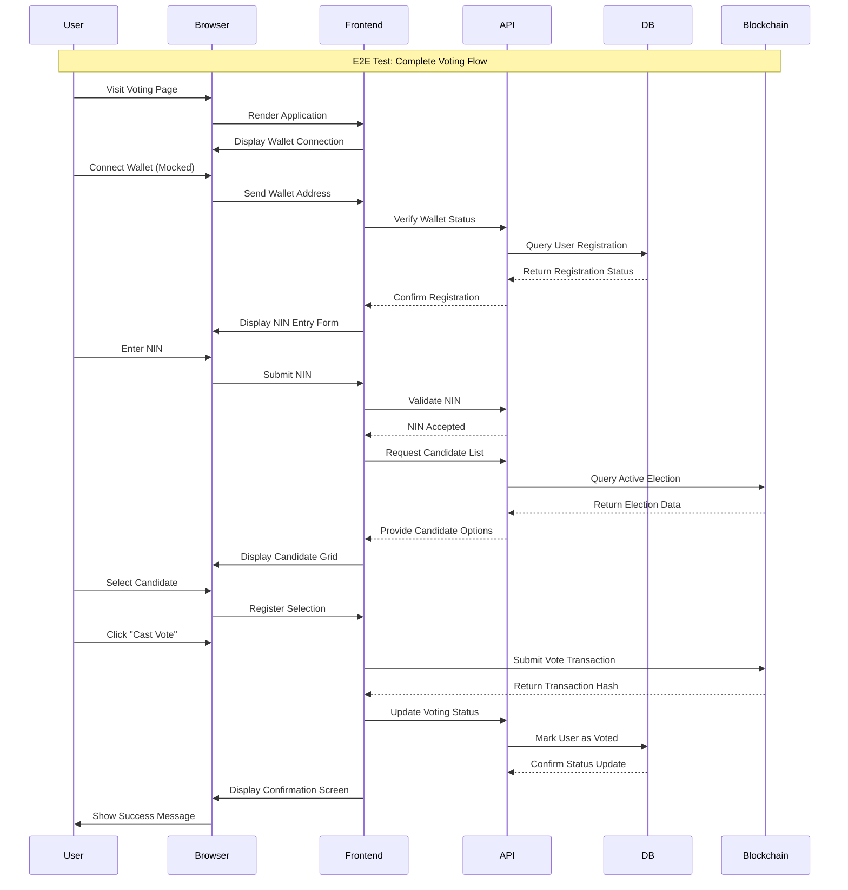

End-to-end testing validated complete user flows through the system:

1. **User Journey Testing**:
   - Complete voter registration flow from start to finish
   - Election creation and management from the admin perspective
   - Full voting process including wallet connection, NIN entry, and candidate selection
   - Transaction confirmation and receipt verification

2. **Environment Configuration**:
   - Browser automation using Cypress for realistic user interaction
   - Mocked wallet providers for consistent testing conditions
   - Network interaction simulation for blockchain transactions
   - Visual verification of UI state changes

3. **Data Flow Validation**:
   - Tracking data transformation through system layers
   - Verifying database state changes after operations
   - Confirming blockchain transaction recording
   - Validating proper display of transaction receipts

4. **Error Recovery Testing**:
   - Network disruption simulation during critical operations
   - Invalid input handling at multiple levels
   - Transaction failure recovery mechanisms
   - User guidance through error conditions
```

### 5.5 Testing Results

The testing phase identified several issues that were subsequently addressed:

1. **Smart Contract Issues**:
   - Double voting prevention failure in edge cases
   - Incorrect handling of election time boundaries
   - Admin access control bypasses

2. **Frontend Issues**:
   - Wallet connection inconsistencies
   - Form validation errors
   - UI rendering issues on mobile devices

3. **Integration Issues**:
   - Transaction confirmation delays
   - Database synchronization failures
   - Error handling inconsistencies

Each issue was documented, prioritized, and resolved before deployment.

## 6. Deployment Strategy

### 6.1 Deployment Process

The BlockVote system is deployed using a phased approach to ensure stability and security:

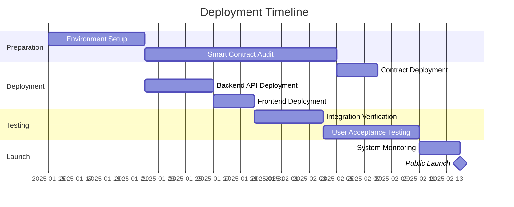

### 6.2 Deployment Architecture

The system is deployed across multiple environments to ensure reliability and separation of concerns:

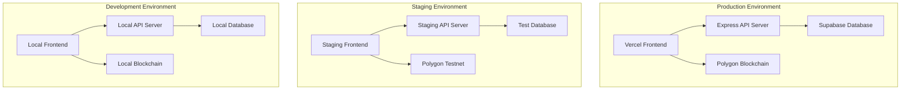

### 6.3 Scaling Strategy

The BlockVote system is designed with scalability in mind:

1. **Frontend Scaling**:
   - Static site generation with React
   - CDN distribution for global access
   - Optimized bundle sizes for faster loading

2. **Backend Scaling**:
   - Horizontal scaling of Express API servers
   - Load balancing for high traffic periods
   - Caching strategies for frequent queries

3. **Database Scaling**:
   - Supabase managed scaling
   - Connection pooling
   - Read replicas for heavy election periods

4. **Blockchain Considerations**:
   - Gas optimization for all transactions
   - Batching strategies for admin operations
   - Scalable L2 solution (Polygon) for faster transactions

### 6.4 Maintenance Plan

Post-deployment, the system will be maintained according to the following plan:

1. **Monitoring**:
   - Real-time performance metrics
   - Error tracking and alerting
   - User activity monitoring

2. **Updates**:
   - Scheduled maintenance windows
   - Smart contract upgrade strategy
   - Frontend feature releases

3. **Backup Strategy**:
   - Regular database backups
   - Contract state archiving
   - Disaster recovery procedures

4. **Security**:
   - Regular security audits
   - Vulnerability scanning
   - Penetration testing

## Conclusion

The BlockVote system provides a secure, transparent, and user-friendly platform for conducting elections on the blockchain. The design and implementation focus on ensuring the integrity of the voting process while making it accessible to voters with varying levels of technical expertise.

The system's architecture separates concerns between the blockchain layer, which provides immutability and transparency, and the application layer, which provides usability and management functionality. This separation allows for a flexible system that can be adapted to different election scenarios while maintaining the core security principles.

Through comprehensive testing and a careful deployment strategy, the BlockVote system is ready to provide a reliable solution for conducting secure elections in various contexts.