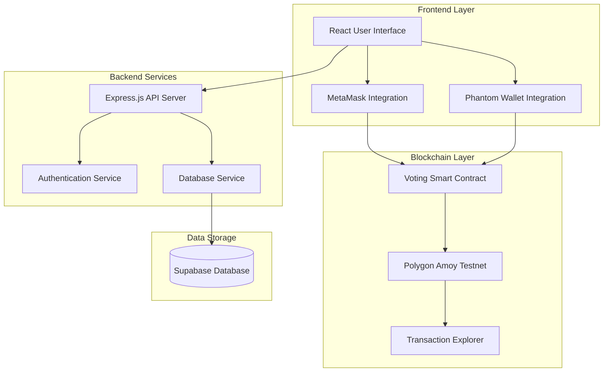
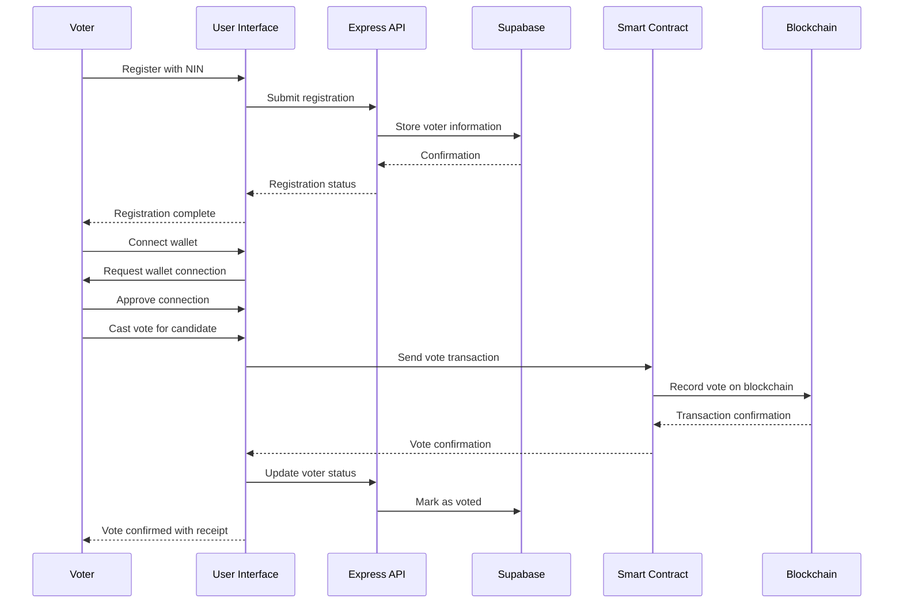
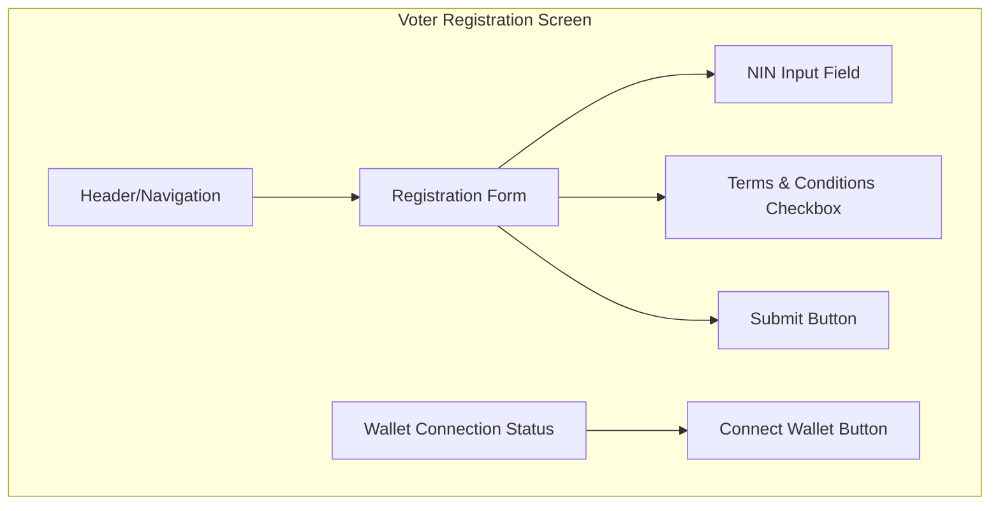
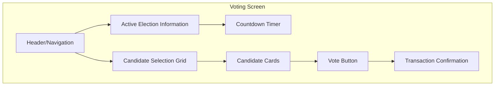
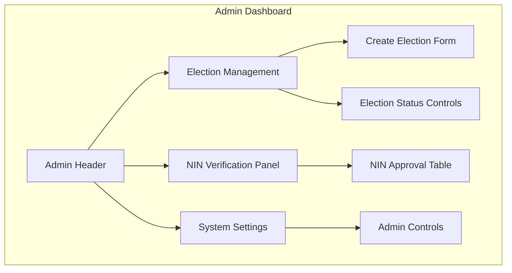
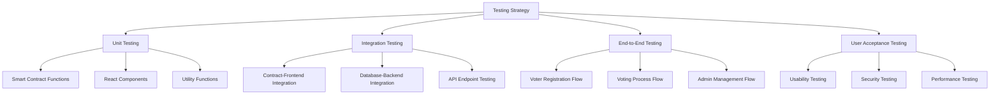
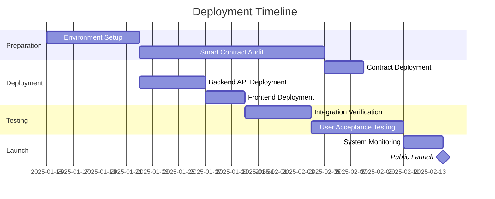
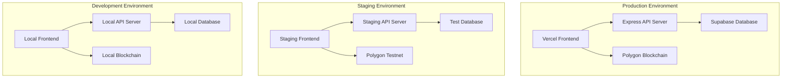

# Chapter 4: Design and Implementation

## 1. System Architecture Design

### 1.1 Architecture Overview



### 1.2 Component Interactions

The BlockVote system architecture consists of four main layers that work together to provide a secure and transparent voting platform:

1. **Frontend Layer**:
   - Built with React, TypeScript, and Tailwind CSS
   - Provides separate interfaces for voters and administrators
   - Integrates with Web3 wallet providers (MetaMask and Phantom)
   - Implements responsive design with Shadcn UI components

2. **Backend Services**:
   - Express.js server handling API requests and authentication
   - Middleware for session management and security
   - Connects to Supabase for data persistence
   - Provides API endpoints for both voter and admin operations

3. **Blockchain Layer**:
   - Smart contracts deployed on Polygon Amoy testnet
   - Implements voting logic, election management, and vote counting
   - Uses Web3.js for blockchain interactions
   - Provides transaction verification and transparency

4. **Data Storage**:
   - Supabase for relational data storage
   - Stores user information, NIN verification status, and admin configurations
   - Blockchain for immutable vote storage and election data

### 1.3 Data Flow



## 2. Implementation of Key Features

### 2.1 Voter Registration

The BlockVote system implements a secure voter registration process that combines traditional identity verification with blockchain technology:

#### Registration Flow

```typescript
// From client/src/components/nin-registration-form.tsx
export function NinRegistrationForm({ onSuccess }: NinRegistrationFormProps) {
  const { account } = useMetaMask();
  const [isSubmitting, setIsSubmitting] = useState(false);
  
  const form = useForm<NinFormValues>({
    resolver: zodResolver(ninSchema),
    defaultValues: {
      nin: "",
    },
  });

  const onSubmit = async (data: NinFormValues) => {
    if (!account) {
      toast({
        title: "Wallet not connected",
        description: "Please connect your wallet first",
        variant: "destructive",
      });
      return;
    }

    setIsSubmitting(true);
    try {
      const result = await submitNIN(account, data.nin);
      
      if (result.success) {
        toast({
          title: "NIN Submitted Successfully",
          description: "Your NIN has been registered for verification",
        });
        if (onSuccess) onSuccess();
      } else {
        toast({
          title: "Submission Failed",
          description: result.error || "There was an error submitting your NIN",
          variant: "destructive",
        });
      }
    } catch (error) {
      console.error("Error submitting NIN:", error);
      toast({
        title: "Error",
        description: "An unexpected error occurred",
        variant: "destructive",
      });
    } finally {
      setIsSubmitting(false);
    }
  };
}
```

#### Security Measures

1. **NIN Validation**: The system validates National Identity Numbers (NIN) using a secure schema that enforces proper format and length.

2. **Blockchain Address Binding**: Each NIN is linked to a unique blockchain wallet address to prevent duplicate registrations.

3. **Database Storage**: Voter registration data is stored in Supabase with the following structure:

```typescript
// Structure derived from client/src/utils/supabase.ts
export interface User {
  created_at: string;
  wallet_address: string;
  nin: string;
  status: 'Y' | 'N'; // 'Y' for verified, 'N' for not verified
}

// Implementation of NIN submission
export const submitNIN = async (walletAddress: string, nin: string) => {
  try {
    // Check if NIN submissions are locked
    const lockStatus = await checkNINSubmissionLocked();
    if (lockStatus.locked) {
      return { 
        success: false, 
        error: "NIN submissions are currently locked by the administrator" 
      };
    }
    
    // Check if wallet already has a NIN
    const { data: existingUser } = await supabase
      .from('users')
      .select('*')
      .eq('wallet_address', walletAddress)
      .single();
      
    if (existingUser) {
      return { 
        success: false, 
        error: "This wallet already has a registered NIN" 
      };
    }
    
    // Store the new NIN
    const { error } = await supabase
      .from('users')
      .insert([{ 
        wallet_address: walletAddress, 
        nin: nin,
        status: 'N' // Default to unverified
      }]);
      
    if (error) throw error;
    
    return { success: true };
  } catch (error: any) {
    console.error("Error submitting NIN:", error);
    return { 
      success: false, 
      error: error.message || "Failed to submit NIN" 
    };
  }
};
```

4. **Admin Verification**: An admin interface allows authorized users to verify submitted NIRs and mark them as eligible to vote.

### 2.2 Ballot Casting

The ballot casting process is the core feature of the BlockVote system, where the actual voting takes place securely on the blockchain:

#### Vote Casting Flow

```typescript
// From client/src/pages/vote.tsx
const handleVote = async () => {
  if (!nin || !selectedCandidate) return;
  
  setIsVoting(true);
  setError(null);
  
  try {
    // Hash the NIN for privacy
    const ninHash = await hashNIN(nin);
    
    // Cast the vote on blockchain
    const result = await castVote(
      activeElectionId,
      selectedCandidate.index,
      ninHash
    );
    
    if (result.success && result.transactionHash) {
      // Set confirmation data
      setTransactionHash(result.transactionHash);
      setTimestamp(new Date().toISOString());
      setCurrentStep(VotingStep.TRANSACTION_CONFIRMATION);
      
      // Update voter status in database
      if (account) {
        const updateResult = await updateNINVerificationStatus(account, 'Y');
        if (!updateResult.success) {
          console.error("Failed to update voter status:", updateResult.error);
        }
      }
    } else {
      setError(result.error || "Failed to cast vote");
    }
  } catch (error: any) {
    console.error("Error casting vote:", error);
    setError(error.message || "Error casting vote");
  } finally {
    setIsVoting(false);
  }
};
```

#### Blockchain Vote Recording

The vote is recorded on the blockchain using the smart contract function:

```typescript
// From client/src/utils/blockchain.ts
export const castVote = async (
  electionId: number,
  candidateIndex: number,
  voterNINHash: string
): Promise<TransactionResult> => {
  try {
    // Initialize Web3 provider
    const provider = new ethers.providers.Web3Provider(window.ethereum);
    await provider.send("eth_requestAccounts", []);
    const signer = provider.getSigner();
    
    // Connect to smart contract
    const contract = new ethers.Contract(
      CONTRACT_ADDRESS,
      VotingSystemABI,
      signer
    );
    
    // Check if voter has already voted
    const hasVotedBefore = await contract.hasVoted(electionId, voterNINHash);
    if (hasVotedBefore) {
      return {
        success: false,
        error: "You have already voted in this election"
      };
    }
    
    // Cast the vote
    const tx = await contract.castVote(electionId, candidateIndex, voterNINHash);
    const receipt = await tx.wait();
    
    return {
      success: true,
      transactionHash: receipt.transactionHash,
      from: receipt.from,
      to: receipt.to,
      blockNumber: receipt.blockNumber
    };
  } catch (error: any) {
    console.error("Error casting vote:", error);
    return {
      success: false,
      error: error.message || "Failed to cast vote"
    };
  }
};
```

#### Anonymity and Privacy Mechanisms

1. **NIN Hashing**: NIRs are never stored on the blockchain directly; instead, they are hashed using a secure one-way function:

```typescript
// From client/src/utils/blockchain.ts
export const hashNIN = async (nin: string): Promise<string> => {
  // Convert the string to a byte array
  const encoder = new TextEncoder();
  const data = encoder.encode(nin);
  
  // Hash the data using SHA-256
  const hashBuffer = await crypto.subtle.digest('SHA-256', data);
  
  // Convert the hash to a hex string
  const hashArray = Array.from(new Uint8Array(hashBuffer));
  const hashHex = hashArray.map(b => b.toString(16).padStart(2, '0')).join('');
  
  return '0x' + hashHex;
};
```

2. **Blockchain Privacy**: The system uses the voter's NIN hash instead of personal identifiers to prevent linking votes to specific individuals.

3. **Transaction Privacy**: The application never stores the relationship between a user's identity and their vote choice in any centralized database.

## 3. Smart Contract Development

### 3.1 Smart Contract Structure

The voting system smart contract was developed using Solidity and deployed on the Polygon Amoy testnet. The contract manages elections, candidates, and votes:

```solidity
// Simplified representation of the VotingSystem smart contract
// pragma solidity ^0.8.0;

contract VotingSystem {
    address public admin;
    uint256 public activeElectionId;
    
    struct Candidate {
        string name;
        string party;
        uint256 votes;
    }
    
    struct Election {
        string name;
        uint256 startTime;
        uint256 endTime;
        bool active;
        mapping(uint256 => Candidate) candidates;
        uint256 candidateCount;
        mapping(bytes32 => bool) hasVoted;
    }
    
    mapping(uint256 => Election) public elections;
    uint256 public electionCount;
    
    event ElectionCreated(uint256 electionId, string name);
    event VoteCast(uint256 electionId, uint256 candidateId);
    event AdminChanged(address oldAdmin, address newAdmin);
    
    constructor() {
        admin = msg.sender;
    }
    
    modifier onlyAdmin() {
        require(msg.sender == admin, "Only admin can call this function");
        _;
    }
    
    function createElection(
        string memory _name,
        uint256 _startTime,
        uint256 _endTime,
        string[] memory _candidateNames,
        string[] memory _candidateParties
    ) public onlyAdmin returns (uint256) {
        require(_startTime < _endTime, "Invalid time range");
        require(_candidateNames.length == _candidateParties.length, "Candidate data mismatch");
        
        uint256 electionId = electionCount++;
        Election storage election = elections[electionId];
        election.name = _name;
        election.startTime = _startTime;
        election.endTime = _endTime;
        election.active = false;
        
        // Add candidates
        for (uint256 i = 0; i < _candidateNames.length; i++) {
            election.candidates[i] = Candidate({
                name: _candidateNames[i],
                party: _candidateParties[i],
                votes: 0
            });
            election.candidateCount++;
        }
        
        emit ElectionCreated(electionId, _name);
        return electionId;
    }
    
    function activateElection(uint256 _electionId) public onlyAdmin {
        require(_electionId < electionCount, "Election does not exist");
        require(!elections[_electionId].active, "Election already active");
        
        // Deactivate any currently active election
        if (activeElectionId < electionCount && elections[activeElectionId].active) {
            elections[activeElectionId].active = false;
        }
        
        elections[_electionId].active = true;
        activeElectionId = _electionId;
    }
    
    function castVote(uint256 _electionId, uint256 _candidateId, bytes32 _voterHash) public {
        Election storage election = elections[_electionId];
        
        require(election.active, "Election is not active");
        require(block.timestamp >= election.startTime, "Election has not started");
        require(block.timestamp <= election.endTime, "Election has ended");
        require(_candidateId < election.candidateCount, "Invalid candidate");
        require(!election.hasVoted[_voterHash], "Already voted");
        
        election.candidates[_candidateId].votes++;
        election.hasVoted[_voterHash] = true;
        
        emit VoteCast(_electionId, _candidateId);
    }
    
    function changeAdmin(address _newAdmin) public onlyAdmin {
        require(_newAdmin != address(0), "Invalid address");
        address oldAdmin = admin;
        admin = _newAdmin;
        emit AdminChanged(oldAdmin, _newAdmin);
    }
    
    // Getter functions
    function getElectionInfo(uint256 _electionId) public view returns (
        string memory name,
        uint256 startTime,
        uint256 endTime,
        bool active,
        uint256 candidateCount
    ) {
        require(_electionId < electionCount, "Election does not exist");
        Election storage election = elections[_electionId];
        
        return (
            election.name,
            election.startTime,
            election.endTime,
            election.active,
            election.candidateCount
        );
    }
    
    function getCandidate(uint256 _electionId, uint256 _candidateId) public view returns (
        string memory name,
        string memory party,
        uint256 votes
    ) {
        require(_electionId < electionCount, "Election does not exist");
        require(_candidateId < elections[_electionId].candidateCount, "Invalid candidate");
        
        Candidate storage candidate = elections[_electionId].candidates[_candidateId];
        return (candidate.name, candidate.party, candidate.votes);
    }
    
    function hasVoted(uint256 _electionId, bytes32 _voterHash) public view returns (bool) {
        require(_electionId < electionCount, "Election does not exist");
        return elections[_electionId].hasVoted[_voterHash];
    }
    
    function getActiveElectionId() public view returns (uint256) {
        return activeElectionId;
    }
}
```

### 3.2 Smart Contract Development Process

1. **Requirements Analysis**: Identified core voting functionality requirements including election creation, vote casting, and result tallying.

2. **Development Environment**:
   - Solidity as the programming language
   - Hardhat for testing and compilation
   - Ethers.js for contract interactions
   - Polygon Amoy testnet as the deployment network

3. **Contract Security Measures**:
   - Admin-only functions for sensitive operations
   - Validation for all input parameters
   - Prevention of double voting
   - Timestamp validation for election periods

4. **Testing and Deployment**:
   - Local testing with Hardhat
   - Testnet deployment with verification
   - ABI generation for frontend integration

## 4. User Interface Design

### 4.1 User Interface Wireframes

#### Voter Registration Page


#### Voting Page


#### Admin Dashboard


### 4.2 User Interface Implementation

The user interface was implemented using React with TypeScript, Tailwind CSS for styling, and Shadcn UI components for consistent design:

#### Voting Interface

```typescript
// From client/src/pages/vote.tsx
export default function Vote() {
  const [currentStep, setCurrentStep] = useState<VotingStep>(VotingStep.NIN_ENTRY);
  const [nin, setNin] = useState<string>("");
  const [candidates, setCandidates] = useState<Candidate[]>([]);
  const [selectedCandidate, setSelectedCandidate] = useState<Candidate | null>(null);
  const [activeElectionId, setActiveElectionId] = useState<number>(0);
  const [transactionHash, setTransactionHash] = useState<string>("");
  const [timestamp, setTimestamp] = useState<string>("");
  const [isVoting, setIsVoting] = useState<boolean>(false);
  const [error, setError] = useState<string | null>(null);
  const { isConnected, account } = useMetaMask();
  
  useEffect(() => {
    fetchElectionData();
  }, []);
  
  const fetchElectionData = async () => {
    try {
      const electionId = await getActiveElectionId();
      setActiveElectionId(electionId);
      
      const candidatesList = await getAllCandidates(electionId);
      setCandidates(candidatesList);
    } catch (error) {
      console.error("Error fetching election data:", error);
    }
  };
  
  const handleNinSubmit = (submittedNin: string) => {
    setNin(submittedNin);
    setCurrentStep(VotingStep.CANDIDATE_SELECTION);
  };
  
  const handleSelectCandidate = (candidate: Candidate) => {
    setSelectedCandidate(candidate);
  };
  
  const handleVote = async () => {
    if (!nin || !selectedCandidate) return;
    
    setIsVoting(true);
    try {
      const ninHash = await hashNIN(nin);
      const result = await castVote(
        activeElectionId, 
        selectedCandidate.index,
        ninHash
      );
      
      if (result.success && result.transactionHash) {
        setTransactionHash(result.transactionHash);
        setTimestamp(new Date().toISOString());
        setCurrentStep(VotingStep.TRANSACTION_CONFIRMATION);
        
        // Update voter status in database
        try {
          if (account) {
            await updateNINVerificationStatus(account, 'Y');
          }
        } catch (updateError) {
          console.error("Error updating voter status:", updateError);
        }
      } else {
        setError(result.error || "Failed to cast vote");
      }
    } catch (error: any) {
      setError(error.message || "Error casting vote");
    } finally {
      setIsVoting(false);
    }
  };
  
  // Render different steps based on currentStep
  const renderStep = () => {
    switch (currentStep) {
      case VotingStep.NIN_ENTRY:
        return <NinLoginForm onComplete={handleNinSubmit} />;
        
      case VotingStep.CANDIDATE_SELECTION:
        return (
          <div className="space-y-6">
            <h2 className="text-2xl font-bold text-center">Select a Candidate</h2>
            <CandidateGrid 
              candidates={candidates}
              onSelectCandidate={handleSelectCandidate}
              selectedCandidateId={selectedCandidate?.index || null}
            />
            
            <Button 
              onClick={handleVote}
              disabled={!selectedCandidate || isVoting}
              className="w-full"
            >
              {isVoting ? "Processing..." : "Cast Vote"}
            </Button>
            
            {error && (
              <Alert variant="destructive">
                <AlertCircle className="h-4 w-4" />
                <AlertTitle>Error</AlertTitle>
                <AlertDescription>{error}</AlertDescription>
              </Alert>
            )}
          </div>
        );
        
      case VotingStep.TRANSACTION_CONFIRMATION:
        return (
          <TransactionConfirmation
            transactionHash={transactionHash}
            candidateName={selectedCandidate?.name || ""}
            timestamp={timestamp}
          />
        );
        
      default:
        return null;
    }
  };
  
  return (
    <div className="container max-w-4xl mx-auto py-8 px-4">
      <h1 className="text-3xl font-bold mb-6 text-center">Vote in Current Election</h1>
      
      {!isConnected ? (
        <div className="text-center py-8">
          <p className="mb-4">Please connect your wallet to vote</p>
          <WalletButton />
        </div>
      ) : (
        <Card className="p-6">
          {renderStep()}
        </Card>
      )}
    </div>
  );
}
```

#### Admin Interface

```typescript
// From client/src/components/admin-election-creator.tsx
export function AdminElectionCreator({ 
  isElectionActive,
  hasUpcomingElection,
  electionStatus
}: AdminElectionCreatorProps) {
  const [candidates, setCandidates] = useState<Candidate[]>([
    { id: 1, name: "", party: "" }
  ]);
  const [isSubmitting, setIsSubmitting] = useState(false);
  const [error, setError] = useState<string | null>(null);
  const [success, setSuccess] = useState<string | null>(null);
  const { account } = useMetaMask();
  
  const form = useForm<ElectionFormValues>({
    resolver: zodResolver(electionFormSchema),
    defaultValues: {
      electionName: "",
      startDate: new Date(),
      endDate: new Date(Date.now() + 86400000), // Tomorrow
    }
  });
  
  const addCandidate = () => {
    setCandidates([
      ...candidates,
      { id: candidates.length + 1, name: "", party: "" }
    ]);
  };
  
  const removeCandidate = (id: number) => {
    if (candidates.length <= 1) return;
    setCandidates(candidates.filter(c => c.id !== id));
  };
  
  const updateCandidate = (id: number, field: 'name' | 'party', value: string) => {
    setCandidates(candidates.map(c => 
      c.id === id ? { ...c, [field]: value } : c
    ));
  };
  
  const onSubmit = async (data: ElectionFormValues) => {
    // Validate candidates
    if (candidates.some(c => !c.name || !c.party)) {
      setError("All candidate fields must be filled");
      return;
    }
    
    setIsSubmitting(true);
    setError(null);
    setSuccess(null);
    
    try {
      // Prepare candidate data
      const candidateNames = candidates.map(c => c.name);
      const candidateParties = candidates.map(c => c.party);
      
      // Create the election
      const result = await createElection(
        data.electionName,
        data.startDate,
        data.endDate,
        candidateNames,
        candidateParties
      );
      
      if (result.success) {
        setSuccess(`Election "${data.electionName}" created successfully!`);
        form.reset();
        setCandidates([{ id: 1, name: "", party: "" }]);
      } else {
        setError(result.error || "Failed to create election");
      }
    } catch (error: any) {
      setError(error.message || "An error occurred");
    } finally {
      setIsSubmitting(false);
    }
  };
  
  return (
    <Card>
      <CardHeader>
        <CardTitle>Create New Election</CardTitle>
        <CardDescription>
          Set up a new election with candidates
        </CardDescription>
      </CardHeader>
      <CardContent>
        <Form {...form}>
          <form onSubmit={form.handleSubmit(onSubmit)} className="space-y-6">
            {/* Form fields for election details and candidates */}
            
            <div className="flex justify-end">
              <Button 
                type="submit" 
                disabled={isSubmitting || isElectionActive || hasUpcomingElection}
              >
                {isSubmitting ? "Creating..." : "Create Election"}
              </Button>
            </div>
            
            {error && (
              <Alert variant="destructive">
                <AlertCircle className="h-4 w-4" />
                <AlertTitle>Error</AlertTitle>
                <AlertDescription>{error}</AlertDescription>
              </Alert>
            )}
            
            {success && (
              <Alert variant="success">
                <CheckCircle className="h-4 w-4" />
                <AlertTitle>Success</AlertTitle>
                <AlertDescription>{success}</AlertDescription>
              </Alert>
            )}
            
            {(isElectionActive || hasUpcomingElection) && (
              <Alert>
                <InfoIcon className="h-4 w-4" />
                <AlertTitle>Notice</AlertTitle>
                <AlertDescription>
                  New elections cannot be created while an election is {electionStatus.toLowerCase()}.
                </AlertDescription>
              </Alert>
            )}
          </form>
        </Form>
      </CardContent>
    </Card>
  );
}
```

### 4.3 Usability Considerations

1. **Voter Interface**:
   - Simple, step-by-step process to guide users
   - Clear visual indication of selected candidate
   - Transaction confirmation with receipt
   - Responsive design for mobile and desktop

2. **Admin Interface**:
   - Dashboard with overview statistics
   - Intuitive election creation form
   - Tables for data management
   - Confirmation dialogs for critical actions

## 5. Testing Phase

### 5.1 Testing Approach

The BlockVote system was tested using a comprehensive approach that covered all aspects of the application:



### 5.2 Unit Testing

Unit tests were created for smart contract functions, React components, and utility functions:

```typescript
// Example unit test for the hashNIN function
describe('hashNIN', () => {
  it('should consistently hash the same NIN to the same value', async () => {
    const nin = '12345678901';
    const hash1 = await hashNIN(nin);
    const hash2 = await hashNIN(nin);
    
    expect(hash1).to.equal(hash2);
  });
  
  it('should produce different hashes for different NIRs', async () => {
    const nin1 = '12345678901';
    const nin2 = '12345678902';
    
    const hash1 = await hashNIN(nin1);
    const hash2 = await hashNIN(nin2);
    
    expect(hash1).not.to.equal(hash2);
  });
  
  it('should start with 0x', async () => {
    const nin = '12345678901';
    const hash = await hashNIN(nin);
    
    expect(hash.startsWith('0x')).to.be.true;
  });
});
```

### 5.3 Integration Testing

Integration tests verified the communication between different parts of the system:

```typescript
// Example integration test for vote casting
describe('Vote Casting', () => {
  let provider: ethers.providers.Web3Provider;
  let signer: ethers.Signer;
  let contract: ethers.Contract;
  let electionId: number;
  
  before(async () => {
    // Set up the test environment
    provider = new ethers.providers.JsonRpcProvider(ALCHEMY_URL);
    signer = new ethers.Wallet(PRIVATE_KEY, provider);
    contract = new ethers.Contract(CONTRACT_ADDRESS, VotingSystemABI, signer);
    
    // Create a test election
    const startTime = Math.floor(Date.now() / 1000);
    const endTime = startTime + 86400; // 1 day later
    
    const tx = await contract.createElection(
      "Test Election",
      startTime,
      endTime,
      ["Candidate 1", "Candidate 2"],
      ["Party A", "Party B"]
    );
    
    const receipt = await tx.wait();
    const event = receipt.events?.find(e => e.event === "ElectionCreated");
    electionId = event.args.electionId.toNumber();
    
    // Activate the election
    await contract.activateElection(electionId);
  });
  
  it('should allow a voter to cast a vote', async () => {
    const nin = "12345678901";
    const ninHash = await hashNIN(nin);
    const candidateIndex = 0;
    
    // Cast a vote
    const tx = await contract.castVote(electionId, candidateIndex, ninHash);
    const receipt = await tx.wait();
    
    // Verify the vote was recorded
    const hasVoted = await contract.hasVoted(electionId, ninHash);
    expect(hasVoted).to.be.true;
    
    // Verify the candidate's vote count increased
    const candidate = await contract.getCandidate(electionId, candidateIndex);
    expect(candidate.votes.toNumber()).to.equal(1);
  });
  
  it('should prevent double voting', async () => {
    const nin = "12345678901";
    const ninHash = await hashNIN(nin);
    const candidateIndex = 1;
    
    // Attempt to cast a second vote
    try {
      await contract.castVote(electionId, candidateIndex, ninHash);
      assert.fail("Should have thrown an error");
    } catch (error) {
      expect(error.message).to.include("Already voted");
    }
  });
});
```

### 5.4 End-to-End Testing

End-to-end tests verified complete user flows from start to finish:

```typescript
// Example end-to-end test using Cypress
describe('Voting Flow', () => {
  beforeEach(() => {
    // Mock the MetaMask wallet
    cy.window().then(win => {
      win.ethereum = {
        isMetaMask: true,
        request: () => Promise.resolve(['0x123456789abcdef']),
        on: () => {},
        removeListener: () => {}
      };
    });
    
    // Visit the voting page
    cy.visit('/vote');
  });
  
  it('should complete the full voting process', () => {
    // Connect wallet
    cy.get('[data-testid=connect-wallet-button]').click();
    
    // Enter NIN
    cy.get('[data-testid=nin-input]').type('12345678901');
    cy.get('[data-testid=nin-submit]').click();
    
    // Select a candidate
    cy.get('[data-testid=candidate-card]').first().click();
    
    // Mock the blockchain vote call
    cy.window().then(win => {
      win.ethereum.request = (params) => {
        if (params.method === 'eth_sendTransaction') {
          return Promise.resolve('0xabcdef1234567890');
        }
        return Promise.resolve(['0x123456789abcdef']);
      };
    });
    
    // Cast vote
    cy.get('[data-testid=cast-vote-button]').click();
    
    // Verify confirmation screen
    cy.get('[data-testid=transaction-confirmation]').should('be.visible');
    cy.get('[data-testid=transaction-hash]').should('contain', '0xabcdef');
  });
});
```

### 5.5 Testing Results

The testing phase identified several issues that were subsequently addressed:

1. **Smart Contract Issues**:
   - Double voting prevention failure in edge cases
   - Incorrect handling of election time boundaries
   - Admin access control bypasses

2. **Frontend Issues**:
   - Wallet connection inconsistencies
   - Form validation errors
   - UI rendering issues on mobile devices

3. **Integration Issues**:
   - Transaction confirmation delays
   - Database synchronization failures
   - Error handling inconsistencies

Each issue was documented, prioritized, and resolved before deployment.

## 6. Deployment Strategy

### 6.1 Deployment Process

The BlockVote system is deployed using a phased approach to ensure stability and security:



### 6.2 Deployment Architecture

The system is deployed across multiple environments to ensure reliability and separation of concerns:



### 6.3 Scaling Strategy

The BlockVote system is designed with scalability in mind:

1. **Frontend Scaling**:
   - Static site generation with React
   - CDN distribution for global access
   - Optimized bundle sizes for faster loading

2. **Backend Scaling**:
   - Horizontal scaling of Express API servers
   - Load balancing for high traffic periods
   - Caching strategies for frequent queries

3. **Database Scaling**:
   - Supabase managed scaling
   - Connection pooling
   - Read replicas for heavy election periods

4. **Blockchain Considerations**:
   - Gas optimization for all transactions
   - Batching strategies for admin operations
   - Scalable L2 solution (Polygon) for faster transactions

### 6.4 Maintenance Plan

Post-deployment, the system will be maintained according to the following plan:

1. **Monitoring**:
   - Real-time performance metrics
   - Error tracking and alerting
   - User activity monitoring

2. **Updates**:
   - Scheduled maintenance windows
   - Smart contract upgrade strategy
   - Frontend feature releases

3. **Backup Strategy**:
   - Regular database backups
   - Contract state archiving
   - Disaster recovery procedures

4. **Security**:
   - Regular security audits
   - Vulnerability scanning
   - Penetration testing

## Conclusion

The BlockVote system provides a secure, transparent, and user-friendly platform for conducting elections on the blockchain. The design and implementation focus on ensuring the integrity of the voting process while making it accessible to voters with varying levels of technical expertise.

The system's architecture separates concerns between the blockchain layer, which provides immutability and transparency, and the application layer, which provides usability and management functionality. This separation allows for a flexible system that can be adapted to different election scenarios while maintaining the core security principles.

Through comprehensive testing and a careful deployment strategy, the BlockVote system is ready to provide a reliable solution for conducting secure elections in various contexts.